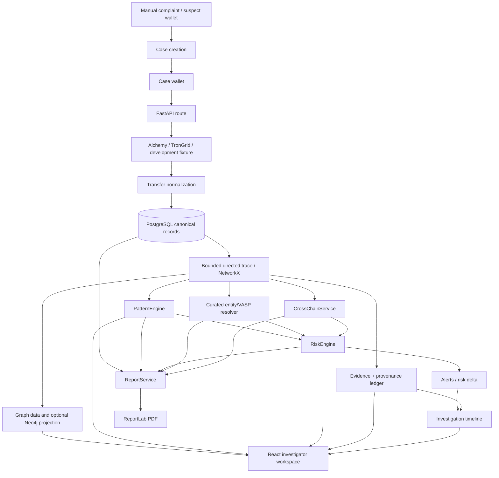

# Complete Project Architecture Audit

Audit date: 2026-08-28  
Repository: `CRYPTO FRAUD INTELLIGENCE` / `RRR — Real-Time Retracing`  
Method: repository inspection, source tracing, tests, build, and local HTTP verification. No feature was considered working solely because a screen or route exists.

## Executive finding

RRR is a modular-monolith blockchain investigation prototype with a real FastAPI/PostgreSQL historical investigation core. The strongest verified path is manual case intake -> provider/fixture trace -> normalized persisted transactions and graph edges -> pattern/risk/attribution services -> React case workspace. Neo4j projection is implemented but optional and currently unavailable in the audited runtime. Cross-chain, realtime webhooks, sanctions, threat intelligence, SAHYOG/NCRP, authentication enforcement, and native mobile are boundaries or development-only capabilities, not fully operational production integrations.

The local runtime was reachable at the audit time:

| Check | Observed result |
|---|---|
| `GET /health` | HTTP 200; PostgreSQL migration status `READY` |
| `GET /api/v1/system/status` | HTTP 200; overall `DEGRADED`; PostgreSQL and Alchemy connected; Neo4j unavailable; TronGrid/realtime/OFAC/threat intelligence not configured |
| `GET /api/v1/system/integrity` | HTTP 200; `WARN`; 10 cases, 103 transactions, 128 evidence records; 17 transactions without case links and 63 risk factors without evidence links |
| `GET /api/v1/graph/status` | HTTP 200; Neo4j `UNAVAILABLE` |
| `GET /api/v1/realtime/health` | HTTP 200; webhook `NOT_CONFIGURED` |
| sanctions status | HTTP 200; `NOT_CONFIGURED`, zero records |
| Backend tests | 92 passed, 3 skipped |
| Frontend tests | 1 passed |
| Frontend production build | Passed (`tsc -b && vite build`) |

## Repository structure

| Area | Location | Finding |
|---|---|---|
| Backend application | `apps/api/app/` | FastAPI routes, Pydantic domain, services, persistence mixins, providers and intelligence engines |
| Backend tests | `apps/api/tests/` | Broad unit/contract coverage; several integration tests skip when services are unavailable |
| Investigator web | `apps/investigator-web/src/` | React + TypeScript + Vite SPA, hash routing, case workspace and capability surfaces |
| PostgreSQL migrations | `infrastructure/postgres/001_initial.sql` through `019_cross_chain_transfer_fields.sql` | Incremental schema, constraints and indexes |
| Static data | `data/attribution`, `data/bridges`, `data/intelligence`, `data/fixtures` | Curated/demo registries; not a complete commercial intelligence feed |
| Reports | `output/pdf/` and `apps/api/app/report_*.py` | Persisted report snapshot and ReportLab PDF renderer |
| Documentation | `docs/architecture`, `docs/audit`, `docs/deployment` | Extensive design and prior audit material; this document is the current source audit |
| Containers | `docker-compose.yml`, two Dockerfiles | PostgreSQL, Redis, Neo4j, API and web services |
| Mobile | `/api/v1/mobile/*`, `docs/architecture/mobile-rrr.md` | API boundary only; no Android/Flutter/React Native project |

## Actual technology inventory

| Technology/capability | Evidence | Current classification |
|---|---|---|
| Python 3 application | `apps/api/requirements.txt`, `apps/api/app/` | IMPLEMENTED |
| FastAPI/Uvicorn | `apps/api/app/main.py`, `apps/api/Dockerfile` | IMPLEMENTED and locally responding |
| Pydantic v2 | `domain.py`, route response models | IMPLEMENTED |
| PostgreSQL/asyncpg | `persistence.py`, migrations 001-019, Docker Compose | IMPLEMENTED; locally connected |
| SQLAlchemy | No import or dependency found | NOT PRESENT |
| React/TypeScript/Vite | `apps/investigator-web/package.json`, `src/main.tsx`, `App.tsx` | IMPLEMENTED; build and test pass |
| CSS design system | `src/*.css`, shared `Shell`/surface classes | IMPLEMENTED |
| Frontend state | React `useState`/`useEffect`; no Redux/Zustand dependency | IMPLEMENTED, local component state |
| Frontend routing | Hash parser in `src/App.tsx` (`parseRoute`, `caseRouteAliases`) | IMPLEMENTED, custom routing |
| Graph UI | `components/GraphInspector.tsx`, SVG/CSS graph implementation | IMPLEMENTED; consumes persisted trace when available |
| NetworkX | `requirements.txt`, `graph_engine.py` | IMPLEMENTED for bounded in-memory trace traversal |
| Neo4j | `graph/neo4j_client.py`, `neo4j_repository.py`, projection routes | IMPLEMENTED OPTIONAL; runtime unavailable |
| Alchemy Ethereum | `provider.py` (`AlchemyEthereumProvider`) | IMPLEMENTED HISTORICAL/RPC; local probe succeeded with configured environment |
| TronGrid | `provider.py` Tron provider and registry | PARTIALLY IMPLEMENTED; local API key not configured |
| Cross-chain correlation | `cross_chain.py`, `cross_chain_service.py`, migration 008/019 | PARTIALLY IMPLEMENTED; explicit evidence/correlation model, not proven live universal coverage |
| Risk engine | `risk_engine.py`, `risk_service.py`, migration 006 | IMPLEMENTED deterministic rule engine; evidence integrity has runtime warnings |
| Pattern engine | `pattern_engine.py`, `pattern_service.py`, migration 005 | IMPLEMENTED rule detectors |
| VASP attribution | `attribution.py`, `synthetic_attribution.py`, migration 004, JSON data | IMPLEMENTED curated/static; commercial provider classes are contracts/stubs |
| Sanctions | `cyber_intelligence.py`, migration 011, status route | PARTIAL/NOT CONFIGURED; no loaded dataset in audited runtime |
| Threat intelligence | `cyber_intelligence.py`, source/indicator tables | PARTIAL data model; no configured external feed |
| Evidence ledger | `evidence_*`, migration 014 | IMPLEMENTED persistence and manifest/hash workflows; some runtime links incomplete |
| Reports/PDF | `report_service.py`, `report_pdf.py`, migration 015 | IMPLEMENTED snapshot/PDF path; content is text-derived and requires data completeness |
| Redis | Compose service, `REDIS_URL` setting | CONFIGURED OPTIONALLY but unused by observed in-process EventBus path |
| Authentication | `auth.py`, settings, route dependency helpers | PARTIAL; disabled by default and no RBAC policy |
| SAHYOG/NCRP | UI labels and intake source values | SIMULATED / NOT PRESENT as external integration |
| Native APK | No Gradle, manifest, Flutter or React Native project | NOT PRESENT |

## End-to-end data flow

### Stage ownership

| Stage | Backend entry point | Persistence/output | Frontend consumer | Audit result |
|---|---|---|---|---|
| Case creation | `POST /api/v1/cases`, repository `create` | `cases` | `ConnectedIntake`, `Intake`, case pages | Verified route; authorization absent |
| Wallet intake | `/cases/{id}/wallets`, `add_wallet` | `wallets`, `case_wallets` | Intake and case context | Verified validation/persistence path |
| Historical trace | `/cases/{id}/traces`, `trace_case`, `TraceService.trace` | `transactions`, `transaction_transfers`, `graph_edges`, `trace_runs`, evidence | App state and GraphInspector | Verified with fixture/tests; live provider credential-dependent |
| Graph projection | `GraphProjectionService`, `/graph/{case}/project` | PostgreSQL authoritative; Neo4j optional | Graph inspector primarily reads TraceResult | Projection implementation exists; Neo4j unavailable locally |
| Primary path | `primary_path.py`, `/cases/{id}/primary-path` | Trace `paths` plus selected IDs | `GraphInspector` primary highlighting | Verified for directed/chronological fixture paths; path logic should be treated as a separate intelligence layer |
| Patterns | `PatternService.analyze` | `pattern_observations` and joins | `PatternsPage` | Unit-tested and persisted |
| Risk | `RiskService.assess`, `RiskEngine` | risk assessments/factors and joins | `RiskPage`, overlays | Unit-tested; runtime integrity shows orphan factor links |
| Attribution | `AttributionEngine`, `NearestEntityResolver` | entity and attribution tables/static registry | entity/graph/report surfaces | Curated/static verified; commercial providers not connected |
| Cross-chain | `CrossChainService.analyze` | cross-chain tables and trace | `CrossChainPage` | Explicit model exists; live correlation needs configured observations/providers |
| Realtime | webhook/simulated routes, `RealtimeService` | realtime events, applications, watches, timeline, alerts | `RealtimePage`, SSE | Simulated path available; live webhook not configured |
| Evidence | `EvidenceService`, evidence routes | evidence, manifests, custody events | evidence panels | Persistence exists; runtime integrity exposes missing joins |
| Report | `ReportService.generate`, PDF route | `investigation_reports`, content hash | `ReportsPage`/download | Implemented; report fidelity depends on populated upstream data |

## Case context and isolation

`case_id` is the primary context key. `Case`, `case_wallets`, `case_transactions`, graph edges, evidence, patterns, risk, realtime applications, alerts, timeline, reports and workflow events carry it. `App.openCase` loads summary, case, graph and operational state, stores `rrr_active_case_id`, and restores it from the hash/local storage.

The repository has a real case-scoped design, but the runtime integrity endpoint proves isolation is not perfect in the current database snapshot: 17 transactions are not linked to a case. Realtime watch matching is global by chain/address in `RealtimeService._all_watches`; identical addresses across active cases can therefore be a risk for cross-case event fan-out unless watch/case selection is tightened. This is a material audit finding.

## Transaction and graph model

The Pydantic `Transfer` model tracks `tx_hash`, `chain`, `block_number`, `timestamp`, `source`, `destination`, `asset`, `amount`, optional native value, provider, transfer type, contract/token/decimals, fee and raw reference. `TransactionDetails`, `TransactionReceipt` and `BlockHeader` provide provider lookup shapes. PostgreSQL separates canonical transaction rows from `transaction_transfers`; graph edges carry source, target, transfer, hop, direction, evidence and transaction metadata.

One normalized transfer can become a transaction row, transfer row, case link, graph edge, evidence observation, pattern input, risk input, timeline event (for realtime), and report line. The relationships are not uniformly complete: historical fixture traces can contain no evidence IDs, and the runtime integrity check reports 63 risk factors without evidence links.

## Blockchain acquisition

`AlchemyEthereumProvider` calls JSON-RPC over `httpx`. Address history uses paginated `alchemy_getAssetTransfers` for both `from` and `to`, categories external/ERC20/ERC721/ERC1155, metadata and bounded page/transaction limits. It separately supports `eth_getTransactionByHash`, `eth_getTransactionReceipt`, `eth_getBlockByNumber`, and RPC health via `eth_blockNumber`. Retries are bounded and provider errors are translated to `ProviderError`.

This is not an assertion that all deployment environments have live data. The audited local `.env` has non-empty provider configuration and the Alchemy health probe succeeded. `.env.example` is intentionally placeholder-based. The application also has `DevelopmentFixtureProvider` and synthetic realtime code, explicitly marked `DEVELOPMENT_FIXTURE` or `DEVELOPMENT_SYNTHETIC`; those records are not blockchain observations.

Supported chains in the domain are Ethereum and Tron. Alchemy implementation is Ethereum-only; TronGrid is a separate provider and is not configured in this runtime. There is no broad multi-chain provider abstraction beyond the supported registry entries.

## Graph-forensics result

The graph uses directed sender-to-recipient `GraphEdge` records. `graph_engine.py` performs bounded traversal over observed transfers. `primary_path.py` builds candidate paths from the root, rejects timestamp regressions and repeated nodes, and resolves the nearest attributed terminal VASP/exchange/custodian using source-backed attribution. The normal graph may contain all observed relationships; the selected primary path is a separate projection used for strong highlighting.

The current development hardcoded endpoint (`POST /api/v1/dev/hardcoded-cases`) persists one path per scenario. Local verification found the following: mixer 5 nodes/4 edges, bridge 6 nodes/5 edges, normal 4 nodes/3 edges; all had `paths: 1`, actual stable amounts, and Demo Exchange attribution. These are synthetic fixtures, not evidence about real addresses.

Neo4j projection preserves wallet, chain, transaction, evidence and `SENT` relationships and uses deterministic IDs. `neighbors` and `shortest-path` queries are available. The authoritative case graph endpoint reads PostgreSQL TraceResult; Neo4j is a projection and may fail without making PostgreSQL unavailable.

## Attribution

`AttributionEngine` and `NearestEntityResolver` consume entity/source/address attribution records. `synthetic_attribution.py` merges a labelled development-only Demo Exchange record when the trace is synthetic. The resolver does not infer a VASP merely from being the last wallet. Commercial classes (`ChainalysisAttributionProvider`, `TrmLabsAttributionProvider`, `EllipticAttributionProvider`) are provider contracts/stubs, not configured integrations. Real-world attribution therefore requires an actually populated trusted catalog and evidence.

## Cross-chain result

The model and migrations are substantial: chains, chain addresses, asset identities/mappings, bridge definitions/interactions, cross-chain links/evidence, trace nodes/edges, cross-chain patterns, and explicit `CrossChainTransfer` fields exist. `CrossChainCorrelationEngine` considers message IDs, recipients, asset/amount and bounded time windows, and fail-closes when destination chain is absent. Links are labelled inferred and correlation levels distinguish exact/strong/probable/possible/unresolved.

This is not a universal live bridge detector. A source and destination observation must be supplied and a known bridge definition/correlation must exist. The development hardcoded bridge case carries synthetic bridge metadata for UI/demo flow, but it is not a live protocol event. The report must say `UNKNOWN` when correlation is not proven.

## Risk and patterns

`PatternEngine` includes detectors for rapid hops, fan-out, fan-in/consolidation, peel chains, burst activity, dormant activation, mixer interaction, bridge interaction and entity exposure. Pattern observations include severity, confidence, affected edges/nodes, transaction hashes, evidence IDs and explanations, then persist through `PatternService`.

`RiskEngine` combines configured factor definitions, pattern matches, entity matches, value characteristics and fraud typology, caps/normalizes against `_RAW_MAX`, selects configurable LOW/GUARDED/ELEVATED/HIGH/CRITICAL bands, persists factors and supports history/delta/alerts. The exact runtime score is data-dependent; the current synthetic cases had distinct scores but all were LOW in the audited database because the existing normalized engine did not populate every requested high-risk signal. This is a demonstration-quality risk engine, not a calibrated AML score.

## Realtime and alerts

`RealtimeService` accepts normalized provider webhook events or explicit simulated events, deduplicates them, applies them to watches, updates PostgreSQL graph/evidence/timeline state, runs pattern/risk work, and emits in-process `RealtimeEventBus` notifications. `processing_attempts`, retry/dead-letter status, replay and watch lifecycle are persisted. The Alchemy webhook route requires signing configuration; local health reports it `NOT_CONFIGURED`. Redis is present in Compose/settings but the observed notification path is an in-process asyncio bus.

## Evidence and reporting

Evidence is stored with case, type, chain, transaction hash, source, capture time, metadata and integrity fields. Migration 014 adds manifests, manifest items and chain-of-custody events. Report content is assembled from current case, trace, evidence, patterns, risk, screenings, alerts, attributions and cross-chain links; it is SHA-256 hashed, persisted, and rendered with ReportLab through `/reports/{report_id}/pdf`.

The report service is substantially data-backed, but empty source data produces explicit “no findings” sections. It is not a guarantee that all 29 requested report topics are populated for every case. The existing PDF is a point-in-time snapshot, and its coverage is limited by missing evidence, live provider status, and the current report model.

## Security audit

- Input validation is materially present through Pydantic and parameterized asyncpg queries.
- CORS is configurable, but `AUTH_REQUIRED=false` in the local environment and no RBAC/case authorization was verified.
- JWT/OIDC verification code exists but is not an active identity system by default.
- Provider credentials are environment-driven; do not commit `.env`. The deployment documentation contains a credential-like Alchemy value and should be reviewed/rotated if it is real.
- Logs include case IDs and operational details. Review production log redaction before using victim/LE data.
- Evidence hashes/manifests exist, but integrity output currently warns about orphaned risk-factor relationships.
- No claim of production security, legal certification, chain-of-custody admissibility, sanctions completeness, or law-enforcement authorization is justified.

## Mobile and external intake

There is no APK project, Gradle build, Android manifest, Flutter project or React Native project. The `/api/v1/mobile/*` routes are a server API boundary for a future client. The correct architecture is mobile -> FastAPI -> same services/repositories/providers; mobile must not hold PostgreSQL, Neo4j or provider credentials.

SAHYOG and NCRP are visible as intake choices and status labels, but no authorized external API client, credential flow, schema adapter, or verified government connection exists. They are SIMULATED/NOT CONFIGURED integration boundaries.

## Verified, simulated, and blocked lists

### Actually implemented and verified

- FastAPI application startup and health/status routes.
- PostgreSQL migrations and local connection.
- Case/wallet/transaction persistence path.
- Ethereum Alchemy historical/RPC adapter path in configured local runtime.
- Deterministic fixture provider and bounded trace models.
- Directed primary-path selection and hardcoded deterministic demo cases.
- Pattern detector unit tests and persistence service.
- Risk assessment/history/factor API and persistence service.
- Curated/static attribution and endpoint resolution.
- Evidence, report snapshot and PDF rendering code.
- React workspace build, API client, hash case context restoration.
- Optional Neo4j projection implementation (not successful in current runtime).

### Implemented but simulated/development-only

- Development fixture blockchain data.
- Synthetic realtime events and deterministic hardcoded cases.
- Demo VASP attribution registry.
- SAHYOG/NCRP intake labels.
- Cross-chain demo records without live protocol proof.
- In-process EventBus development notifications.
- Mobile API foundation without an actual client.

### Not implemented, blocked, or not configured

- Native APK/mobile application.
- Live SAHYOG/NCRP connection.
- Enforced authentication/RBAC.
- Live TronGrid in audited runtime.
- Alchemy webhook registration/live realtime (credentials not configured for webhook).
- OFAC/sanctions dataset in audited runtime.
- External threat-intelligence feed.
- Neo4j availability in audited runtime.
- Clean database integrity: orphan transaction and risk-factor relationships remain.
- Calibrated production AML risk model and complete external VASP intelligence.

## Final assessment

RRR is suitable for a controlled technical demonstration in development mode and for continued engineering. It is not ready for sensitive production or law-enforcement deployment until identity/access control, database integrity, evidence linkage, provider/webhook operations, Neo4j availability strategy, sanctions/threat feeds, cross-chain production correlation, report completeness, and operational ownership are resolved.
