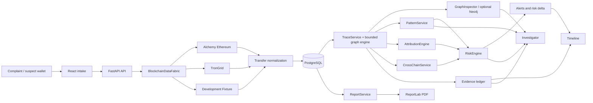

# Complete Project Technical Report

## 1. Executive summary

RRR is a backend-first blockchain fraud investigation workspace. Its authoritative data store is PostgreSQL. FastAPI exposes case, trace, graph, intelligence, realtime, evidence, timeline, report and mobile-boundary APIs. React/Vite renders the investigator UI. NetworkX performs bounded trace/path work; Neo4j is an optional projection. The application is materially implemented, but several advertised capabilities are configuration-gated or simulated.

## 2. Architecture

## 3. Repository and backend

The backend is a Python 3.12-compatible FastAPI app in `apps/api/app`. `main.py` wires the repository, provider registry, trace service, attribution, patterns, risk, realtime, cross-chain, graph projection, evidence, report, and auth helpers. `domain.py` contains the Pydantic contracts. `persistence.py` is the PostgreSQL repository assembled from persistence mixins. This is a modular monolith, not independently deployed services.

The trace path is: `TraceService.trace` -> provider registry -> normalized `Transfer` objects -> bounded graph traversal -> `PostgresCaseRepository.persist_trace` -> `transactions`, `transaction_transfers`, `case_transactions`, `graph_edges`, `trace_runs`, and evidence. `primary_path.py` separately selects a simple directed chronological path and resolves an attributed terminal entity.

## 4. Frontend workflow

`src/App.tsx` owns hash routing, case loading and restoration. `openCase` loads summary, case, graph and operational state and stores the active case ID in local storage. The case route aliases cover overview, transactions, graph, fund-flow, patterns, risk, realtime, entities, cross-chain, threat intelligence, sanctions, evidence, timeline and reports. Major data consumers are `GraphInspector`, `TransactionLedger`, `PatternsPage`, `RiskPage`, `RealtimePage`, `CrossChainPage`, `EvidenceLedgerPanel`, `ReportsPage`, `WorkflowPanel`, and command-center components.

The graph is not a generic replacement component: `GraphInspector.tsx` preserves the existing SVG controls, draggable nodes, fit/center/reset behavior, inspectors and layout persistence. It consumes `TraceResult` and primary-path metadata. Frontend state is React local state rather than Redux or another global store.

## 5. Database architecture

Migrations `001`–`019` create the case/wallet/transaction foundation; transfer normalization; traces; entity attribution; pattern observations; risk and audit; realtime/watch/timeline/alerts; cross-chain chains/assets/bridges/links/traces; cyber intelligence; alert reviews; evidence manifests/custody; reports; workflow; curated VASP/layout; and trace acquisition/cross-chain fields.

Core relationships are: `cases` -> `case_wallets` -> `wallets`; `cases` -> `case_transactions` -> `transactions` -> `transaction_transfers`; `graph_edges` joins a case and transaction; `trace_runs` records acquisition; evidence joins cases and may reference hashes; patterns and risk join traces, transactions, entities and evidence; realtime events join applications, watches, attempts and timeline; reports snapshot case state. Foreign keys and unique indexes exist, but the live integrity endpoint currently reports 17 transactions without case links and 63 risk factors without evidence links.

## 6. Blockchain acquisition

`AlchemyEthereumProvider` uses `httpx` JSON-RPC. `alchemy_getAssetTransfers` is paginated and bounded for inbound/outbound categories; transaction, receipt and block methods are separately implemented. Provider failures retry and become controlled provider errors. The local audit observed a successful Alchemy `eth_blockNumber` probe, so the local environment was configured for Ethereum historical/RPC access at audit time. This does not prove every deployment has credentials.

TronGrid exists as a provider implementation and registry entry, but the audited status was `NOT_CONFIGURED`. `DevelopmentFixtureProvider` is deterministic and intentionally not live chain data. The selected mode comes from `BLOCKCHAIN_DATA_MODE`.

## 7. Transaction graph and primary path

`GraphEdge` represents sender -> recipient and retains transfer, hash, timestamp, block, asset, amount, chain, hop, direction and evidence. `graph_engine.py` is bounded graph analysis. `primary_path.py` performs directed candidate traversal, rejects repeated nodes and timestamp regressions, and chooses an endpoint with source-backed VASP/exchange/custodian attribution when available; otherwise it terminates at a leaf or explicitly reports unknown.

The development endpoint `POST /api/v1/dev/hardcoded-cases` persists three deterministic paths. Verification found one path in each case: mixer (4 edges), bridge (5 edges), normal (3 edges). This meets demo-path semantics but is explicitly synthetic. Real cases must use persisted provider evidence; the UI must not be used as the path-selection authority.

Neo4j projection in `graph/neo4j_repository.py` creates deterministic constraints and `Case`, `Wallet`, `Transaction`, `Evidence`, `Chain` nodes plus `SENT`, `TRANSFERS`, `SUPPORTED_BY`, `CONTAINS`, and `ON_CHAIN` relationships. PostgreSQL remains authoritative. Current local Neo4j status is `UNAVAILABLE`.

## 8. Attribution and cross-chain

Attribution requires an entity and address-attribution record, confidence, role, source and optional evidence. Synthetic attribution is merged only for development-labelled traces. Commercial attribution provider classes are interfaces/stubs and do not establish live vendor connectivity.

Cross-chain logic is in `cross_chain.py`, `cross_chain_service.py`, `cross_chain_persistence.py`, migrations 008 and 019. It models source/destination chains, bridge definitions/interactions, asset mappings, correlation levels, evidence and explicit `CrossChainTransfer`. Correlation uses message IDs, recipient, asset/amount and bounded time. Missing destination chain fails closed. The implementation is a real analytical boundary, but live correlation requires supplied observations and configured bridge/chain providers; a synthetic bridge record is not a live protocol proof.

## 9. Pattern and risk intelligence

Pattern detectors include `RapidHopDetector`, `FanOutDetector`, `FanInDetector`, `PeelChainDetector`, `ConsolidationDetector`, `BurstActivityDetector`, `DormantActivationDetector`, `MixerInteractionDetector`, `BridgeInteractionDetector`, and `EntityExposureDetector`. Observations carry affected nodes/edges, hashes, evidence, severity, confidence, explanation and fingerprint.

The risk engine has configurable factor definitions, pattern/entity/value/typology inputs, normalization against `_RAW_MAX`, configurable risk bands, history, delta and alert candidates. It is explainable rule-based scoring, not a statistical or law-enforcement-certified AML score. Risk is persisted in `risk_assessments` and `risk_factors`, but the current integrity warning shows relationship completeness needs repair.

## 10. Realtime and alerts

Realtime sources are signed Alchemy webhook input and explicit simulated events. `RealtimeService` normalizes, deduplicates, applies watches, writes graph/evidence/timeline records, performs pattern/risk work and emits an in-process `RealtimeEventBus` stream. Watch subscriptions, attempts, retries, dead-letter state and replay APIs are persisted. Live webhook health was `NOT_CONFIGURED`; therefore local synthetic events must never be presented as live events.

## 11. Evidence, timeline and reports

Evidence records carry ID, case, type, chain, transaction hash, source, capture time and metadata. Migration 014 adds manifests, items and chain-of-custody events. ReportService composes a point-in-time report from persisted case, trace, evidence, patterns, risk, alerts, screenings, attribution and cross-chain data, hashes the text with SHA-256 and persists the snapshot. `report_pdf.py` renders the snapshot with ReportLab. Empty upstream data produces explicit no-data text; report quality is therefore bounded by upstream completeness.

## 12. API architecture and status

The main route families are system/provider/chains; entities/attribution; intelligence/sanctions/contracts; case CRUD/open/status; trace/graph/path/layout; transactions; patterns; risk; realtime/watches/events/stream; cross-chain observations/analysis/links/paths; evidence; reports/PDF; timeline/workflow/audit/related cases; alerts; and mobile feed/case/watch/trace. The route inventory is in `main.py` and the requested status matrix is in `IMPLEMENTATION_STATUS_MATRIX.md`.

## 13. Security assessment

Pydantic validation and parameterized asyncpg queries are meaningful controls. Auth code exists but `AUTH_REQUIRED=false`; there is no verified RBAC/case authorization. CORS is configurable. Secrets are environment-based, but deployment documentation contains a credential-like value that should be rotated if real. Evidence hashing is present, but current integrity warnings prevent a clean forensic-integrity claim. Production requires OIDC/SSO, RBAC, secret rotation, audit access logging, redaction, rate limits, provider isolation, retention controls and formal chain-of-custody governance.

## 14. Judge-friendly explanation

Fraud investigations are slow when an investigator must manually inspect many transactions, chains and service labels. RRR takes a complaint or suspect wallet, retrieves bounded blockchain observations, normalizes them into a canonical ledger, shows the directed fund flow, detects behavior, scores risk, resolves source-backed VASP/entity exposure, correlates supported cross-chain evidence, monitors new activity, preserves evidence and creates a report snapshot. The core value is continuity: the same case ID connects the wallet, transaction, graph edge, pattern, risk factor, evidence, timeline and report. The system is a demonstrable investigation platform, not a claim that every external intelligence or government integration is live.

## 15. Final technical assessment

**Conditionally suitable for controlled demonstration.** The historical PostgreSQL/FastAPI/React path is real and tested. Neo4j, TronGrid, live realtime webhooks, sanctions, threat feeds, SAHYOG/NCRP and native APK are not fully operational in the audited environment. Resolve data integrity findings and identity/access control before sensitive deployment.
